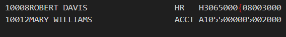

# SEQ3000 — Advanced Sequential File Processing & Data Validation

The **SEQ3000** program is a sophisticated COBOL utility designed for high-integrity data processing. Building upon the foundations of its predecessors, this program reads customer records, performs complex logic-based validations, and generates a detailed report that ensures data consistency across the master file.

## What it does 
* **Sequential Record Processing:** Efficiently iterates through the customer master file to extract and process individual record entries.
* **Complex Data Validation:** Implements rigorous checks to identify discrepancies in customer accounts, ensuring only valid financial data is summarized.
* **Integrated Reporting:** Generates a structured output that summarizes key metrics, providing a clear view of the sequential data flow.
* **Error Handling:** Identifies and flags malformed records or unexpected data types to maintain the stability of the enterprise pipeline.
* **Automated Formatting:** Manages report headers, page breaks, and column alignment to produce a professional-grade audit trail.

## New COBOL Concepts Implemented
Compared to previous iterations like **SEQ1000** and **SEQ2000**, this version introduces:
* **Nested Logic Structures:** Implementation of complex `IF-ELSE` and `EVALUATE` statements to handle multi-step data verification.
* **Advanced File Status Handling:** Utilizes `FILE STATUS` codes and condition names (`88` levels) for robust error trapping during `OPEN`, `READ`, and `CLOSE` operations.
* **Calculated Fields & Rounding:** Uses `COMPUTE` with `ROUNDED` functionality to ensure that total sums and averages maintain financial accuracy across large datasets.
* **Enhanced Working-Storage Management:** Optimized use of `PIC` clauses and group items to better manage memory and record layouts during sequential processing.

## Program Output

Below is a screenshot of the SEQ3000 execution, showing the processed records and the resulting summary report:

 

---

### Author Profiles
* [Tristan Joubert - GitHub](https://github.com/TJoubert004)
