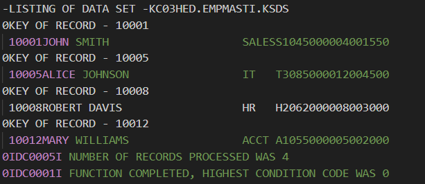

# VSAM KSDS Management & Random Access 

This repository contains a comprehensive suite of COBOL programs and JCL procedures designed to manage employee records using both sequential and indexed (VSAM) file structures.

---

## SEQ3000 — Advanced Sequential File Processing & Data Validation

The **SEQ3000** program is a sophisticated COBOL utility designed for high-integrity data processing. Building upon the foundations of its predecessors, this program reads customer records, performs complex logic-based validations, and generates a detailed report that ensures data consistency across the master file.

### What it does
* **Sequential Record Processing**: Efficiently iterates through the customer master file to extract and process individual record entries.
* **Complex Data Validation**: Implements rigorous checks to identify discrepancies in customer accounts, ensuring only valid financial data is summarized.
* **Integrated Reporting**: Generates a structured output that summarizes key metrics, providing a clear view of the sequential data flow.
* **Error Handling**: Identifies and flags malformed records or unexpected data types to maintain the stability of the enterprise pipeline.
* **Automated Formatting**: Manages report headers, page breaks, and column alignment to produce a professional-grade audit trail.

---

## EMPIND01 — VSAM KSDS Initialization

The **EMPIND01** program serves as the bridge between legacy sequential data and modern indexed storage. It is responsible for the initial load of the **Employee Master Index**.

* **Sequential to Indexed Conversion**: Reads the flat `OLDEMP` file and populates the `EMPMASTI` VSAM cluster.
* **Key-Based Loading**: Establishes the `IR-EMPLOYEE-ID` as the primary record key for the Indexed Sequential Access Method (KSDS).
* **Invalid Key Handling**: Implements error trapping during the initial write to catch duplicate IDs or sequence errors in the source data.

---

## EMPIND02 — Random Access Master File Maintenance

**EMPIND02** is a high-performance maintenance utility that utilizes **Random Access** to update the VSAM Employee Master. Unlike the balanced-line approach of `SEQ3000`, this program jumps directly to specific records for immediate processing.

* **Transactional Logic (ACD)**: Processes a transaction file containing Add (A), Change (C), and Delete (D) requests.
* **Randomized Lookups**: Uses the `READ... INVALID KEY` syntax to instantly determine if an employee exists in the master file without reading the entire dataset.
* **Dynamic Record Updates**: 
    * **Add**: Formats new 57-byte master records from 50-byte transaction data.
    * **Change**: Selectively updates fields (Name, Dept, Salary) only if the transaction data is non-blank or non-zero.
    * **Delete**: Removes the record directly from the indexed cluster using the `DELETE` verb.
* **Audit Trail**: Any failed transactions, such as trying to delete a non-existent ID, are written to a dedicated `ERRTRAN` error file.

---

## Mainframe Implementation & JCL

The project includes a full suite of **Job Control Language (JCL)** to manage the VSAM lifecycle on the IBM Z/OS environment.

* **IDCAMS Utility**: Uses `STEP1` and `STEP2` in `JCLEMP01` to delete existing clusters and define new VSAM KSDS structures with specific `RECORDS`, `RECORDSIZE`, and `KEYS` parameters.
* **Compilation & Execution**: Employs the `IGYWCLG` cataloged procedure to compile, link-edit, and execute the COBOL source code.
* **Data Verification**: Includes `JCLPVAMS`, which utilizes the `IDCAMS PRINT` command to dump the VSAM cluster contents in character format for auditing.

---

## New COBOL & Mainframe Concepts Implemented

Compared to previous iterations like `SEQ1000` and `SEQ2000`, this project introduces:
* **VSAM KSDS Management**: Defining and managing Key Sequenced Data Sets using `IDCAMS`.
* **Indexed File I/O**: Implementation of `ORGANIZATION IS INDEXED` and `ACCESS IS RANDOM` in the Environment Division.
* **I-O Open Mode**: Utilizing `OPEN I-O` to allow for both reading and writing (updating) on the same file during a single execution.
* **Key Operations**: Practical application of `WRITE`, `REWRITE`, and `DELETE` verbs for indexed record management.
* **VSAM File Status**: Monitoring `ERRTRAN-FILE-STATUS` and using 88-level condition names to ensure mainframe file integrity.
* **Nested Logic Structures**: Implementation of complex `IF-ELSE` statements to handle multi-step data verification.

---

## Program Output

Below are the execution results of the SEQ3000 program and the EMPIND02 Program using the JCLPVSAM.jcl file:

### SEQ3000

### Unknown Name Validation

---

## Author Profiles

* **Tristan Joubert** - [GitHub Profile](https://github.com/your-profile-link)
